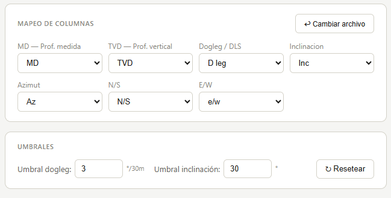
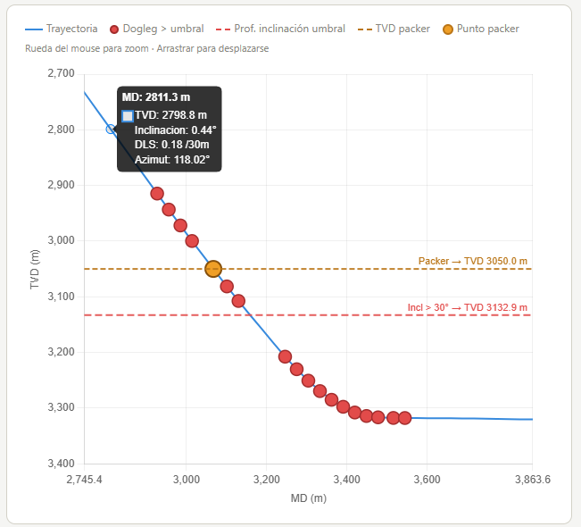
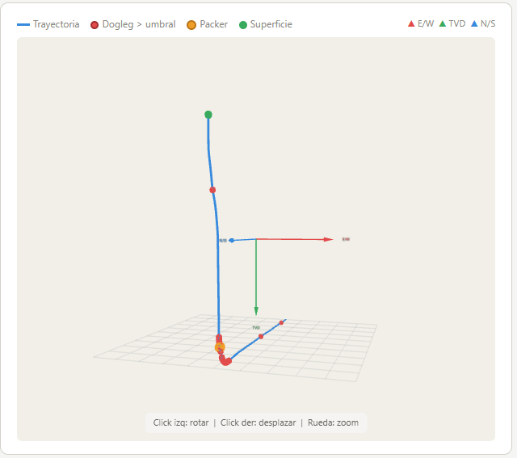
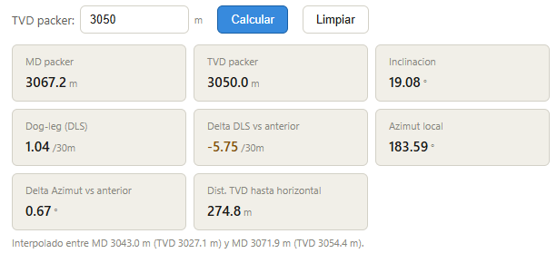

[README.md](https://github.com/user-attachments/files/27596491/README.md)
# Well Directional Visualizer

A lightweight, self-contained web application for visualizing and analyzing directional well survey data. Load your Excel or CSV survey file and instantly explore the well trajectory in both 2D and interactive 3D, with built-in dogleg severity alerts and a packer depth calculator.

---

## Screenshots
### Input


### 2D View — TVD vs MD


### 3D Trajectory


### Packer Calculator


---

## Features

- **File import** — drag-and-drop or click to load `.xlsx`, `.xls`, or `.csv` survey files; auto-detects common column names (MD, TVD, DLS, Inclination, Azimuth, N/S, E/W)
- **Column mapping** — manual override for any column header that wasn't auto-detected
- **2D chart** — TVD vs MD with TVD axis increasing downward; supports mouse-wheel zoom and click-drag pan
- **Dogleg severity alerts** — points where DLS exceeds a user-defined threshold are highlighted in red on both the 2D and 3D views
- **Inclination threshold line** — horizontal dashed line marking the TVD at which inclination first exceeds the defined threshold
- **3D trajectory view** — interactive Three.js scene showing the well path in E/W · TVD · N/S space
  - Left-click drag → rotate
  - Right-click drag → pan
  - Mouse wheel → zoom
  - Touch support: one finger rotates, two fingers zoom and pan
- **Packer depth calculator** — enter a TVD value and get interpolated well parameters at that depth:
  - MD, TVD
  - Inclination
  - Dogleg severity (DLS)
  - ΔDLS vs previous survey station
  - Local azimuth
  - ΔAzimuth vs previous survey station
  - Distance TVD to horizontal (TD)
- **Summary statistics** — max MD, max TVD, max inclination, max DLS, alert point count
- **Zero backend** — runs entirely in the browser; no server, no database, no data leaves your machine

---

## Getting Started

### Option A — HTML file (simplest)

No installation required.

1. Download `visualizador_pozo.html`
2. Double-click to open in any modern browser (Chrome or Edge recommended)
3. An internet connection is needed on first load to fetch Chart.js, SheetJS, and Three.js from the CDN; after that the libraries are cached locally

### Option B — Windows executable

Produces a standalone `VisualizadorPozo.exe` (~30 MB) that opens in its own window without a visible browser.

**Prerequisites**

- [Python 3.10+](https://www.python.org/downloads/) — check *"Add Python to PATH"* during installation

**Steps**

1. Place these three files in the same folder:
   ```
   visualizador_pozo.html
   launcher.py
   build_exe.bat
   ```
2. Double-click `build_exe.bat` — it installs `pywebview` and `PyInstaller`, then compiles the executable
3. Find the output at `dist\VisualizadorPozo.exe`
4. The `.exe` is fully portable — copy it to any Windows machine; no Python or browser installation needed

---

## Input File Format

The application accepts any Excel or CSV file that contains survey data in columns. Column names are detected automatically using fuzzy matching; the table below shows the keywords looked for:

| Parameter | Detected if the header contains… |
|---|---|
| Measured Depth (MD) | `md`, `measured depth`, `depth`, `prof med` |
| True Vertical Depth (TVD) | `tvd`, `vert`, `tvert` |
| Dogleg Severity (DLS) | `dogleg`, `dls` |
| Inclination | `incl`, `inc`, `angle`, `inclinac` |
| Azimuth | `azimuth`, `azimut`, `azi` |
| N/S displacement | `n/s`, `ns`, `north`, `norte` |
| E/W displacement | `e/w`, `ew`, `east`, `este` |

If a column is not detected automatically, use the column mapping dropdowns to assign it manually.

**Minimum required columns:** MD and TVD. All other columns are optional.

---

## Packer Criteria Reference

The following directional criteria are commonly used when defining packer setting depth. These are encoded as default thresholds in the application and can be adjusted at any time:

| Criterion | Default threshold |
|---|---|
| Maximum inclination | 30° |
| Dogleg severity | 2°/30 m |
| Azimuth | Avoid abrupt trajectory changes |

Additional qualitative criteria to consider:
- Minimize distance to reservoir
- Avoid casing couplings
- Good casing integrity
- Adequate cement support, especially for thin-wall casing

---

## Tech Stack

| Library | Version | Purpose |
|---|---|---|
| [Chart.js](https://www.chartjs.org/) | 4.4.1 | 2D scatter / line chart |
| [SheetJS (xlsx)](https://sheetjs.com/) | 0.18.5 | Excel and CSV parsing |
| [Three.js](https://threejs.org/) | r128 | 3D well trajectory rendering |
| [pywebview](https://pywebview.flowrl.com/) | latest | Native window wrapper (exe build) |
| [PyInstaller](https://pyinstaller.org/) | latest | Python → Windows executable |

No build step, bundler, or framework is required for the HTML version — everything runs as plain HTML + JavaScript.

---

## Project Structure

```
├── visualizador_pozo.html   # Main application (self-contained)
├── launcher.py              # pywebview entry point for the .exe build
├── build_exe.bat            # One-click Windows build script
├── assets                   # Images  
└── README.md
```

---

## License

MIT — free to use, modify, and distribute.
